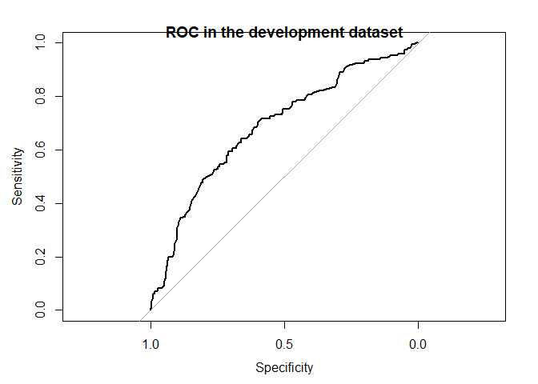
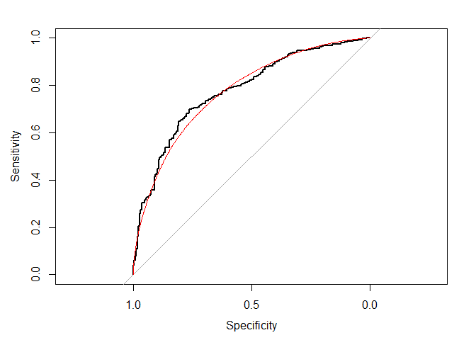
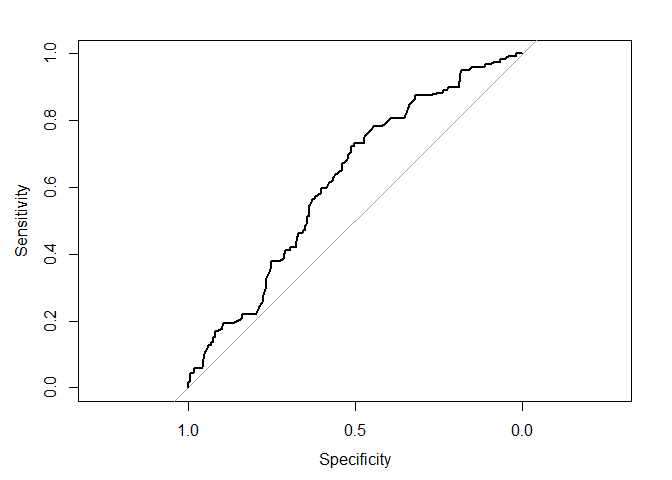
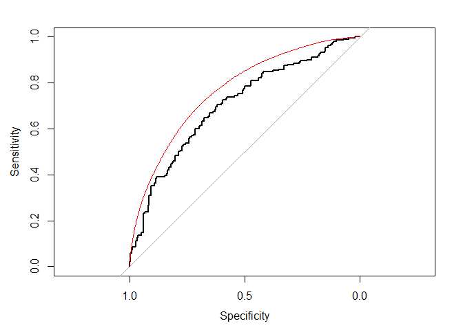

Tutorial for model-based ROC (mROC) analysis
================

# predtools

<!-- badges: starts -->

[](https://github.com/resplab/predtools/actions)
<!-- badges: end -->

## Installation

You can install the released version of predtools from
[CRAN](https://CRAN.R-project.org) with:

``` r
install.packages("predtools")
```

And the development version from [GitHub](https://github.com/) with:

``` r
# install.packages("remotes")
remotes::install_github("resplab/predtools")
```

## Example

## What is predtools?

Imagine you have developed a risk prediction model using some
development dataset. The risk prediction model takes in some predictors
(e.g., sex, age, previous disease history) and returns the risk of an
event (e.g., risk of disease relapse in the next 12 months). You would
like to evaluate the performance of the risk model in a new (external)
validation sample. Among other things, you typically evaluate the
Receiver Operating Characteristic (ROC) curve of the risk prediciton
model in the new sample.

Now, model-based ROC (mROC) curve is the ROC curve that should be
observed if the prediction model is calibrated in the external
population. Comparing the empirical ROC and mROC curves in the new
sample can be informative on if the model is calibrated in the new
sample.

## How the package works

The package provides simple functions for mROC-related methods. It also
comes with exemplary datasets. Below we provide a step-by-step
illustration

## A step-by-step guide

Imagine the variable y indicates risk of disease recurrence in a unit of
time. We have a prediction model that quantifies this risk given a
patient’s age, disease severity level, sex, and whether the patient has
comorbidity.

The package comes with two exemplary datasets. dev\_data and val\_data.
We use the dev\_data as the development sample and the val\_data as the
external validation sample.

``` r
library(predtools)
data(dev_data)
data(val_data)
```

dev\_data has 500 rows. val\_data has 400 rows.

Here are the first few rows of dev\_data:

| age | severity | sex | comorbidity |   y |
|----:|---------:|----:|------------:|----:|
|  55 |        0 |   0 |           1 |   1 |
|  52 |        1 |   0 |           0 |   0 |
|  63 |        0 |   0 |           1 |   0 |
|  61 |        1 |   1 |           1 |   1 |
|  58 |        0 |   1 |           0 |   0 |
|  54 |        1 |   0 |           0 |   1 |
|  45 |        0 |   0 |           0 |   0 |

We use the development data to fit a logistic regression model as our
risk prediction model:

``` r
reg<-glm(y~sex+age+severity+comorbidity,data=dev_data,family=binomial(link="logit"))
summary(reg)
#> 
#> Call:
#> glm(formula = y ~ sex + age + severity + comorbidity, family = binomial(link = "logit"), 
#>     data = dev_data)
#> 
#> Deviance Residuals: 
#>     Min       1Q   Median       3Q      Max  
#> -1.2904  -0.8272  -0.6373   1.1570   2.1050  
#> 
#> Coefficients:
#>              Estimate Std. Error z value Pr(>|z|)    
#> (Intercept) -1.728929   0.565066  -3.060  0.00222 ** 
#> sex          0.557178   0.223631   2.492  0.01272 *  
#> age          0.005175   0.010654   0.486  0.62717    
#> severity    -0.557335   0.227587  -2.449  0.01433 *  
#> comorbidity  1.091936   0.209944   5.201 1.98e-07 ***
#> ---
#> Signif. codes:  0 '***' 0.001 '**' 0.01 '*' 0.05 '.' 0.1 ' ' 1
#> 
#> (Dispersion parameter for binomial family taken to be 1)
#> 
#>     Null deviance: 602.15  on 499  degrees of freedom
#> Residual deviance: 560.41  on 495  degrees of freedom
#> AIC: 570.41
#> 
#> Number of Fisher Scoring iterations: 4
```

Given this, our risk prediction model can be written as:

*l**o**g**i**t*(*p*) =  − 1.7289 + 0.5572 \* *s**e**x* + 0.0052 \* *a**g**e* − 0.5573 \* *s**e**v**e**r**i**t**y* + 1.0919 \* *c**o**m**o**r**b**i**d**i**t**y*.

First, let’s compare the ROC and mROC in the development data

``` r
pred<-predict.glm(reg, type='response')

library(pROC)
#> Type 'citation("pROC")' for a citation.
#> 
#> Attaching package: 'pROC'
#> The following objects are masked from 'package:stats':
#> 
#>     cov, smooth, var
dev_roc<-roc(response=dev_data[,'y'], predictor=pred)
#> Setting levels: control = 0, case = 1
#> Setting direction: controls < cases
plot(dev_roc)
title("ROC in the development dataset")
```



And now the much-awaited mROC using these data. Note that we use the
line function to add the mROC on top

``` r
dev_mroc<-mROC(p=pred)
```

``` r
plot(dev_roc)
lines(dev_mroc, col="red")
```



### Important note: the statistical inference on comparing mROC and ROC cannot be used for internal validation. Such a test is made for external validation.

Now lets calculate the predicted probabilities for each subject in the
validation dataset given the prediction equation.

``` r
pred<-predict.glm(reg,newdata = val_data, type="response")

summary(pred)
#>    Min. 1st Qu.  Median    Mean 3rd Qu.    Max. 
#>  0.1008  0.1853  0.2794  0.2891  0.4053  0.5714
```

Using the package pROC, let’s draw the validation ROC curve

``` r
val_roc<-roc(response=val_data[,'y'], predictor=pred)
#> Setting levels: control = 0, case = 1
#> Setting direction: controls < cases
plot(val_roc)
```



And now the much-awaited mROC using these data. Note that we use the
line function to add the mROC on top

``` r
val_mroc<-mROC(p=pred)
```

Notice that the mROC function only requires the vector of predicted
probabilities.

To compare the ROC and mROC plots, we juxtapose them next to each other:

``` r
plot(val_roc)
lines(val_mroc, col="red")
```



Here, it is obvious that the mROC and ROC curve are not compatible,
indicating that the model is not calibrated.

``` r
res<-mROC_inference(val_data[,'y'],pred)

res
#> Mean calibration statistic (A):0.00835868(Obs>Pred) (p:0.7237)
#> mROC/ROC equality statsitic (B):0.05910898 (p:0.04791)
#> Unified statistic:6.778506 (df:4.025799,p:0.1501357)
```
